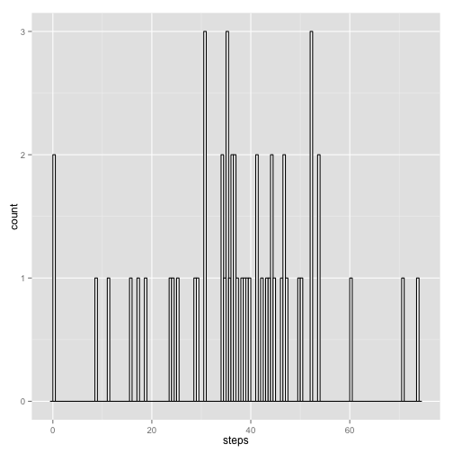
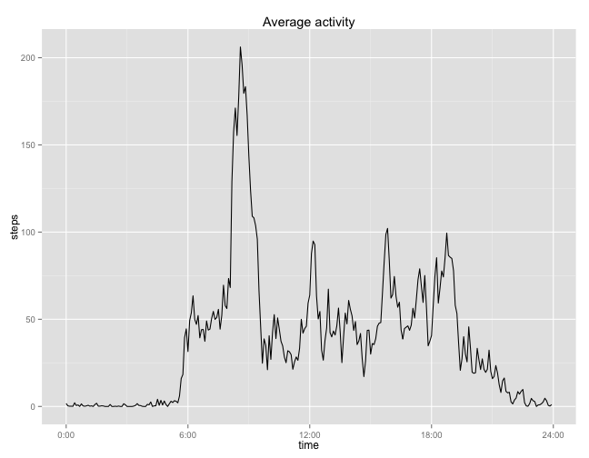
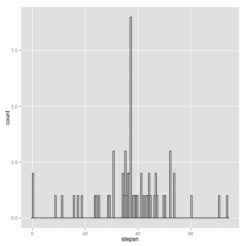
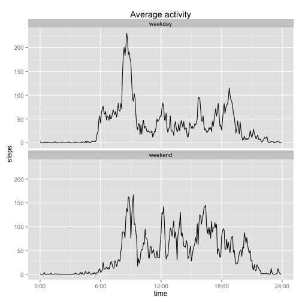

```r
## Loading libraries
library(dplyr)
library(ggplot2)
```
## Loading and preprocessing the data

## unzip data in directory

```r
    unzip("activity.zip")
    act<-read.csv("activity.csv")
## As interval is not continous adding column with continous scale
tt<-rep(0:287,length=17568)
act$tt<-tt
```

## What is mean total number of steps taken per day?
### Total number of steps each day

```r
   avg<-aggregate(steps~date,act,mean) 
ggplot(data=avg,aes(x=steps))+ geom_histogram(binwidth=.5,colour="black",fill="white")
```

 
### Mean of steps is:

```r
mean(avg$steps)
```

```
## [1] 37.3826
```

### Median of steps is:

```r
median(avg$steps)
```

```
## [1] 37.37847
```

## What is the average daily activity pattern?

```r
pattern<-aggregate(steps~tt,act,mean)
ggplot(data=pattern,aes(x=tt,y=steps))+geom_line()+labs(title="Average activity",x= "time",y="steps")+scale_x_continuous(breaks=c(0,72,144,216,288), labels=c("0:00", "6:00", "12:00","18:00","24:00"))
```

 

### Interval with maximum steps on average

```r
a <- subset(pattern,steps==max(pattern$steps,na.rm=TRUE))
max_int<-a[1,1]
max_int
```

```
## [1] 103
```

## Imputing missing values
### 1.Calculate and report the total number of missing values in the dataset (i.e. the total number of rows with NAs)

```r
 empty<-is.na(act$steps)
 sum(empty)
```

```
## [1] 2304
```
### 2.Devise a strategy for filling in all of the missing values in the dataset
As strategy the mean of each 5- minutes interval is used to replace NA
The variable -pattern- calculated above contains the average of steps for each interval
Filling NA with the average of the respective time resulting in a new dataframe act_m1
First step is merging pattern into act, then by mapply with a self defined function, replacing all NA values by mean

```r
## merge act with pattern
act_m<-merge(act,pattern,"tt")
## Function for mapply 
afn<-function(x,y){
            if (is.na(x)){
                y
            } else
                {x}
    }
act_m$stepsn<-mapply(afn,act_m$steps.x,act_m$steps.y)
##remove columns necessary for merging
act_m1<-act_m[,c(1,3,6)]
avg1<-aggregate(stepsn~date,act_m1,mean) 
   ##hist(avg1$stepsn,main="Histogram of average steps each day",xlab="Steps",ylim=c(0,30))
ggplot(data=avg1,aes(x=stepsn))+ geom_histogram(binwidth=.5,colour="black",fill="white")
```

 

### Calculation of corrected median

```r
mean(avg1$stepsn)
```

```
## [1] 37.3826
```

```r
median(avg1$stepsn)
```

```
## [1] 37.3826
```

Mean is equal but median is shifted. Shift to median ?  

## Are there differences in activity patterns between weekdays and weekends?

```r
act_m1$wd<-weekdays(as.Date(as.character(act_m1$date),format="%Y-%m-%d"),abbreviate=T)
wdf<-function(x){
        if (x=="Sa"|x=="So"){
                "weekend"
        } else {"weekday"}
}
act_m1$wdn<-mapply(wdf,act_m1$wd)
pattern_ww<-aggregate(stepsn~tt+wdn,act_m1,mean)
p1<-ggplot(data=pattern_ww,aes(x=tt,y=stepsn))+geom_line()+labs(title="Average activity",x= "time",y="steps")+scale_x_continuous(breaks=c(0,72,144,216,288), labels=c("0:00", "6:00", "12:00","18:00","24:00"))
p1+facet_wrap(~wdn,ncol=1)
```

 
